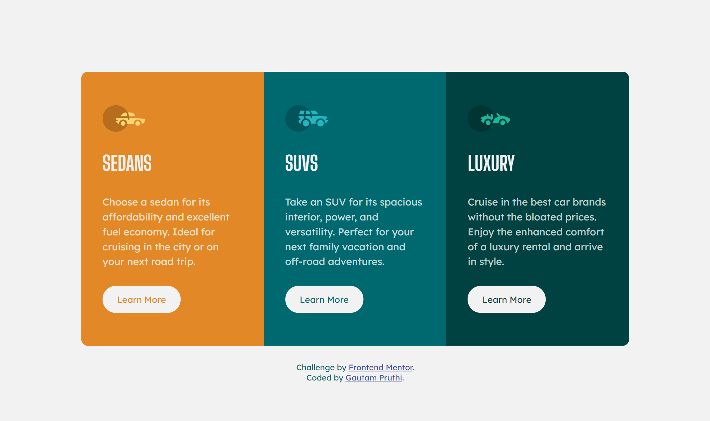

# Frontend Mentor - 3-column preview card component solution

This is a solution to the [3-column preview card component challenge on Frontend Mentor](https://www.frontendmentor.io/challenges/3column-preview-card-component-pH92eAR2-).   

## Table of contents

- [Overview](#overview)
  - [The challenge](#the-challenge)
  - [Links](#links)
  - [Screenshot](#screenshot)
- [My process](#my-process)
  - [Built with](#built-with)
  - [What I learned](#what-i-learned)
  - [Continued development](#continued-development)
- [Author](#author)

 

## Overview

 

### The challenge

 

Users should be able to:

- View the optimal layout depending on their device's screen size
- See hover states for interactive elements

 

### Links

- Solution URL: [Solution URL](https://www.frontendmentor.io/solutions/previewcardcomponent-site-using-react-cssgrid-and-flexbox-I4y6gM-0L)
- Live Site URL: [Preview Card-Component](https://preview-card-component1201.netlify.app/)

 

### Screenshot

 

## My process

 

### Built with

- Semantic HTML5 markup
- CSS custom properties
- Flexbox
- CSS Grid
- Mobile-first workflow
- [React](https://reactjs.org/) - JS library

 

### What I learned

I learned how to use React framework to create a responsive preview-card component.

 

### Continued development

I would like to further practice and develop my understanding of React by building more projects using the React framework.

 

## Author

- Frontend Mentor - [@Gautam1201](https://www.frontendmentor.io/profile/Gautam1201)